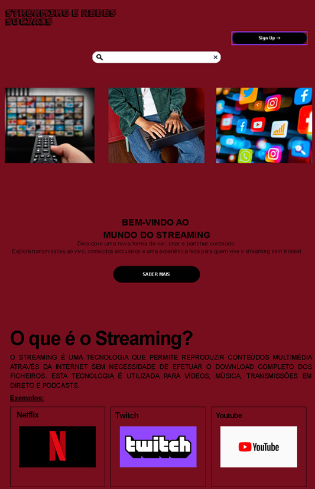
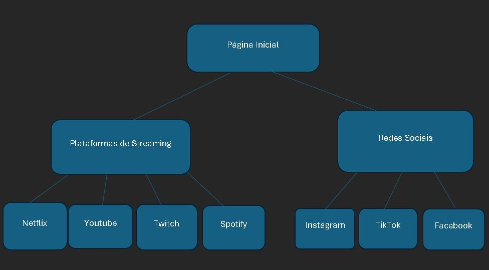
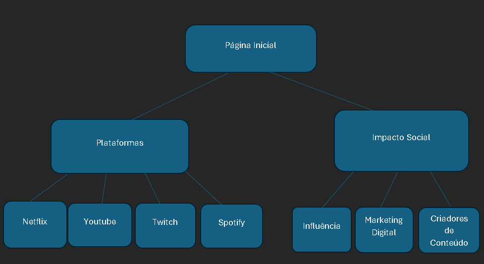

# C2 : Interface do Utilizador

O website será desenvolvido seguindo uma abordagem **Mobile First**, garantindo que os conteúdos sejam apresentados de forma clara e acessível em dispositivos móveis antes da adaptação para tablets e computadores.

A navegação será simples e intuitiva, através de um menu presente em todas as páginas. O design terá um estilo moderno e minimalista, inspirado nas plataformas de streaming atuais, utilizando cores escuras com destaques em vermelho e branco.

A organização da informação será feita da seguinte forma:

* **Página Inicial:** introdução ao tema, breve história do streaming e destaques principais.
* **Plataformas de Streaming:** informação sobre Netflix, YouTube, Twitch e Spotify, incluindo imagens, vídeos e uma tabela comparativa.
* **Impacto das Redes Sociais:** influência das redes sociais na sociedade, marketing digital, criadores de conteúdo e elementos interativos desenvolvidos com JavaScript.

Em dispositivos móveis os conteúdos serão organizados numa única coluna para facilitar a leitura. Em ecrãs maiores, os elementos serão distribuídos por várias colunas, proporcionando uma melhor utilização do espaço disponível.

## Interface e Funcionalidades Comuns

As funcionalidades e características comuns a todas as páginas serão:

* Cabeçalho com o título do website e menu de navegação;
* Rodapé com informações sobre o projeto;
* Layout responsivo adaptado a diferentes tamanhos de ecrã;
* Integração de imagens, vídeos e outros conteúdos multimédia;
* Utilização consistente das cores e da identidade visual;
* Animações e efeitos visuais desenvolvidos com CSS3;
* Funcionalidades interativas implementadas com JavaScript.

## Esboços (Sketches)

### Esboço da Página Inicial

**Descrição:** Esboço da página inicial apresentando o cabeçalho com menu de navegação, uma imagem de destaque relacionada com o streaming e uma breve introdução ao tema.

### Esboço da Página das Plataformas

**Descrição:** Esboço da página das plataformas de streaming mostrando a organização dos conteúdos em cartões informativos, imagens representativas e uma tabela comparativa entre as diferentes plataformas.

## Wireframes

### Wireframe do Website

**Descrição:** Wireframe da estrutura principal do website, incluindo cabeçalho, menu de navegação, secções de conteúdo e rodapé. O layout foi desenvolvido para ser responsivo e adaptar-se a dispositivos móveis, tablets e computadores.

## Sitemap

A estrutura do website será organizada da seguinte forma:

* Página Inicial

  * História do Streaming
* Plataformas de Streaming

  * Netflix
  * YouTube
  * Twitch
  * Spotify
* Impacto das Redes Sociais

  * Influência na Sociedade
  * Marketing Digital
  * Criadores de Conteúdo

### Mapa do Website
<h2>Sitemap</h2>

**Descrição:** Diagrama que representa a organização das páginas e a navegação principal entre as diferentes secções do website.

### Mapa Alternativo do Website
<h2>Sitemap Alternativo</h2>

**Descrição:** Representação alternativa da estrutura do website, mostrando a relação entre as páginas principais e os respetivos conteúdos.

---

| [< Anterior](c1.md) | [^ Principal](../../../) | [Seguinte >](c3.md) |
| :------------------ | :----------------------: | ------------------: |
